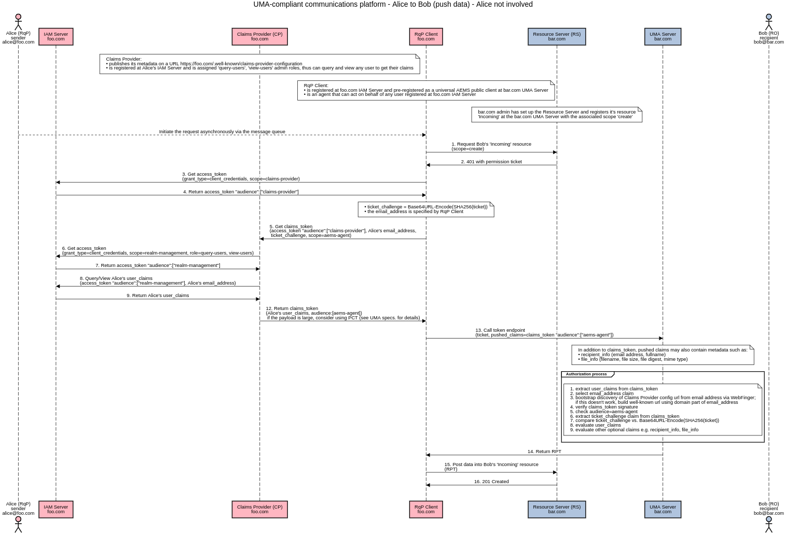
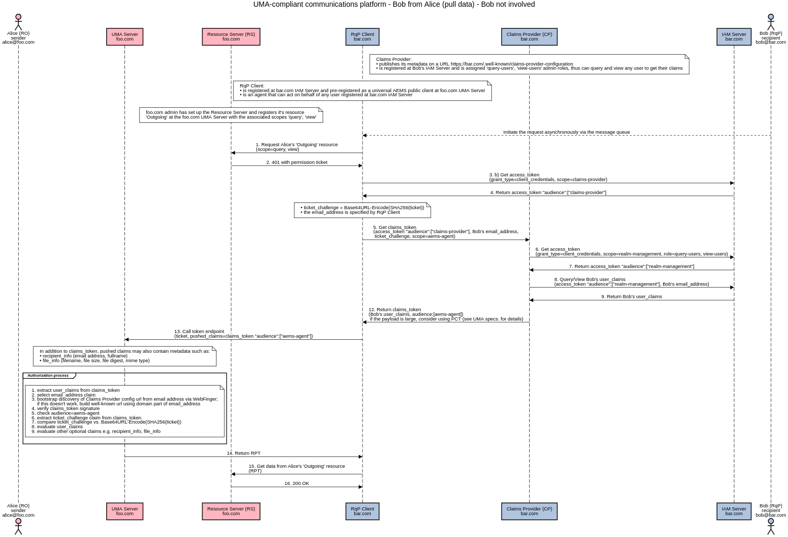

# Authorization-Enhanced Mail System

A prototype implementation of the [Authorization-Enhanced Mail System (AEMS)][1] draft proposal, working as a proof of concept.

## Screenshot

# Decentralized Identity-Based Access Control

To transfer data from sender to recipient, AEMS uses the [Decentralized Identity-Based Access Control (DIBAC)][2] technology that is built around the UMA 2.0 protocol standard (AEMS ⊃ DIBAC ⊃ UMA 2.0).

DIBAC works without central shared OIDC provider as well as without federated OIDC providers. There is no need to build a trust relationship between security domains. This concept uses the UMA-compliant challenge–response mechanism with the permission ticket.

The RqP Client is pre-registered as a universal AEMS public client at the UMA server (an open network) or is registered as a confidential client (a closed network).

The diagrams are not vendor neutral; several Keycloak IAM features are used here (realm-management client, query-users and view-users roles) to get claims of any user.

## Sequence diagrams

### Push data

### Pull data

## Demo and Documentation

WIP, early stage [umabox.org][3].

## Acknowledgment

Credits go to [WG - User Managed Access][4].

[1]: https://github.com/uma-email/proposal
[2]: https://github.com/dibac/proposal
[3]: https://www.umabox.org
[4]: https://kantarainitiative.org/confluence/display/uma/Home
