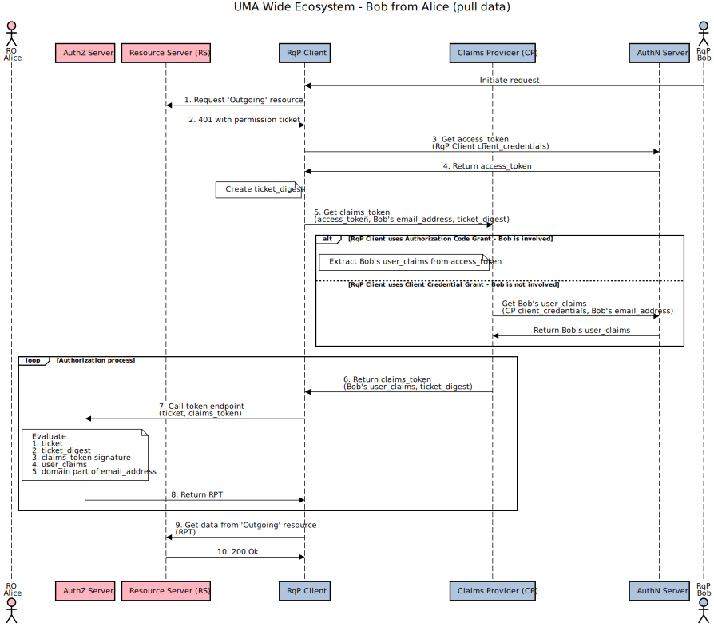

# Authorization-Enhanced Mail System (AEMS)

A prototype implementation of the [authorization-enhanced-mail-system][1] draft proposal, working as a proof of concept.

## Screenshot

## Schematic Flows

### Push email links

### Pull email data

## Sequence diagrams

To transfer data from sender to recipient, AEMS uses a push/pull mechanism and an UMA wide ecosystem topology (AEMS ⊃ UMA wide ecosystem).

This concept works without shared OIDC provider and without federated OIDC providers.
There is no contract between security domains foo.com and bar.com. This concept uses an UMA-based challenge–response authentication with correlation handle.

In addition to claims_token, pushed claims may also contain metadata such as: recipient_info (email address, fullname), file_info (filename, file size, file digest, mime type).

### Push data

### Pull data

## Demo and Documentation

WIP, early stage [umabox.org][2].

[1]: https://github.com/uma-email/proposal
[2]: https://www.umabox.org
