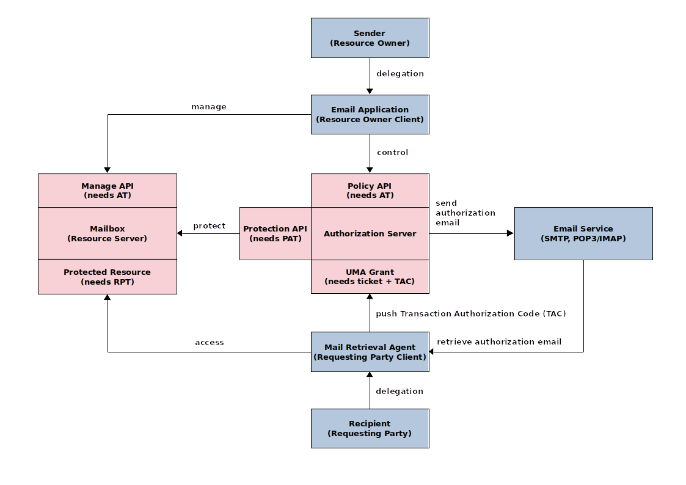
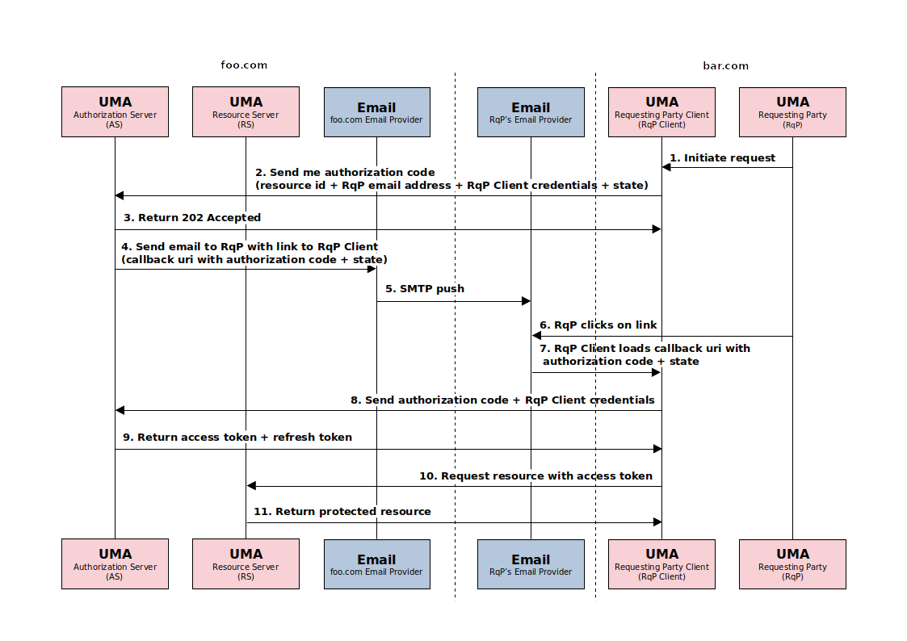

# Authorization-Enhanced Mail System

A prototype implementation of the [authorization-enhanced-mail-system][1] draft proposal, working as a proof of concept.

## Screenshot

## Schematic Flow

## Sequence Diagram

## Demo and Documentation

WIP, early stage [federizer.org][2].

[1]: https://github.com/uma-email/proposal
[2]: https://www.federizer.org
