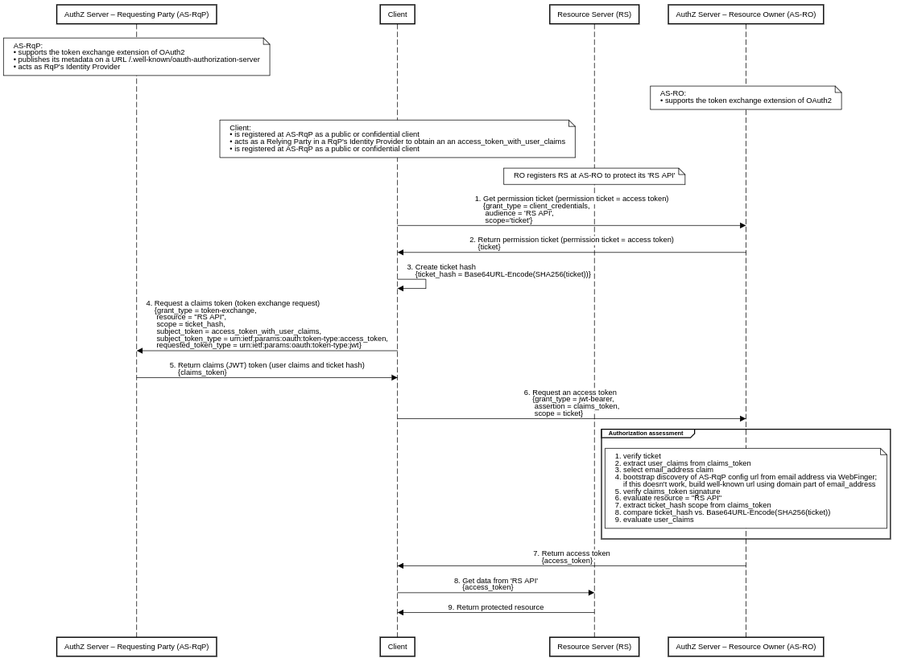
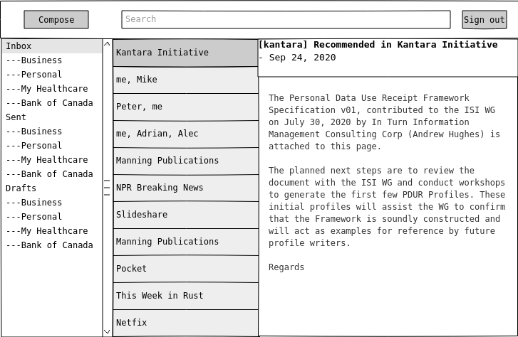

# Correlated Authorization

Correlated Authorization (CAZ) is a dual-authority, cross-domain authorization protocol built on top of [User-Managed Access (UMA)][1] and [OAuth2][2] protocols that allows users (resource owners) to delegate access to other users (requesting parties) across security domains. The requesting party is responsible for creating the request, while the resource owner approves this request either when it is online or by creating a policy. The resource owner and the requesting party belong to different security domains administered by mutually isolated authorities, each with its own identity provider and authorization server. This concept uses a permission ticket issued by the resource owner's authorization server as a correlation handle that binds the requesting party's claims to the authorization process. An email address is used as the unique requesting party identifier for cross-domain access control.

## Sequence diagrams

There are two versions of the sequence diagram that describe the mechanism of the CAZ protocol. The first version represents the CAZ profile of the UMA protocol. The second version profiles the OAuth2 protocol. Both profiles rely on the token exchange extension of OAuth2, where an access token is used to obtain a claims token from the Security Token Service (STS) endpoint.

### UMA profile

This diagram is in full compliance with the UMA specification.

Prerequisites:

* Both authorization servers support the [OAuth 2.0 Token Exchange][5] extension of OAuth2.
* The AS-RqP also acts as RqP's Identity Provider.
* The AS-RqP publishes its metadata on a URL /.well-known/oauth-authorization-server (alternatively on /.well-known/openid-configuration).
* The RqP Client is registered at the AS-RqP as a public or confidential client and acts as a Relying Party in a RqP's Identity Provider to obtain an access token with user claims.
* The RqP Client is registered at the AS-RO as a public or confidential client.
* The RO has set up the RS and registers its 'RS API' resource at the AS-RO according to the [UMA Federated Authorization][6] specification.

Steps:

1. The RqP directs the RqP Client to access the 'RS API' resource with no access token.
2. Without an access token, the RS will return HTTP code 401 (Unauthorized) with a permission ticket.
3. The RqP Client creates a ticket challenge derived from the permission ticket using the following transformation ticket_challenge = Base64URL-Encode(SHA256(ticket)).
4. At the AS-RqP the RqP Client requests a claims token by presenting the access token with user claims and the created ticket challenge.
5. The AS-RqP returns the claims token.
6. At the AS-RO the RqP Client requests an RPT by presenting the claims token and the permission ticket.
7. After an authorization assessment, it is positive, the AS-RO returns RPT.
8. With the valid RPT the RqP Client tries to access the 'RS API'.
9. The RS validates the RPT, it is valid, the RS allow access the protected 'RS API' resource. 

### OAuth2 profile

This diagram represents a profile of the OAuth2 protocol and lacks some UMA features.

Prerequisites:

* Both authorization servers support the [OAuth 2.0 Token Exchange][5] extension of OAuth2.
* The AS-RqP also acts as RqP's Identity Provider.
* The AS-RqP publishes its metadata on a URL /.well-known/oauth-authorization-server (alternatively on /.well-known/openid-configuration).
* The RqP Client is registered at the AS-RqP as a public or confidential client and acts as a Relying Party in a RqP's Identity Provider to obtain an access token with user claims.
* The RqP Client is registered at the AS-RO as a public or confidential client.
* The RO registers the RS at the AS-RO to protect its RS API.

Steps:

1. The RqP Client requests the AS-RO to get a permission ticket to access the 'RS API' resource. The created permission ticket is an access token with a scope 'ticket'.
2. The AS-RO returns the permission ticket.
3. The RqP Client creates a ticket challenge derived from the permission ticket using the following transformation ticket_challenge = Base64URL-Encode(SHA256(ticket)).
4. At the AS-RqP the RqP Client requests a claims token by presenting the access token with user claims and the created ticket challenge.
5. The AS-RqP returns the claims (JWT) token.
6. At the AS-RO the RqP Client requests an access token via a JWT grant type by presenting the claims (JWT) token and the permission ticket.
7. After an authorization assessment, it is positive, the AS-RO returns the access token.
8. With the valid access token the RqP Client tries to access the 'RS API'.
9. The RS validates the access token, it is valid, the RS allow access the protected 'RS API' resource.

## Scenarios

...

## Use cases

Healthcare and enterprise cross-domain services e.g. email, file sharing, instant messaging, tele-conferencing.

## Future Work

1. Consider a Correlated Authentication (CAN) protocol, where RS/AS acts as an external attribute provider.
2. Employ the DPoP mechanism and create the permission ticket directly on the client to avoid the initial round trip to RS/AS.

# Authorization-Enhanced Mail System

A prototype implementation of the [Authorization-Enhanced Mail System (AEMS)][4] draft proposal, working as a proof of the concept of CAZ.

AEMS provides a mechanism to store, share and transfer information across security domains. From the user's point of view, AEMS looks like a standard email system.

## Screenshot

## Demo and Documentation

WIP, early stage [umabox.org][7].

## Acknowledgment

Credits go to [WG - User-Managed Access][8].

[1]: https://en.wikipedia.org/wiki/User-Managed_Access
[2]: https://datatracker.ietf.org/doc/html/rfc6749
[3]: https://github.com/uma-email/proposal/blob/master/correlated-authorization-draft-00.pdf
[4]: https://github.com/uma-email/proposal/blob/master/authorization-enhanced-mail-system-draft-02.pdf
[5]: https://www.rfc-editor.org/rfc/rfc8693.html
[6]: https://docs.kantarainitiative.org/uma/wg/rec-oauth-uma-federated-authz-2.0.html
[7]: https://www.umabox.org
[8]: https://kantarainitiative.org/confluence/display/uma/Home
