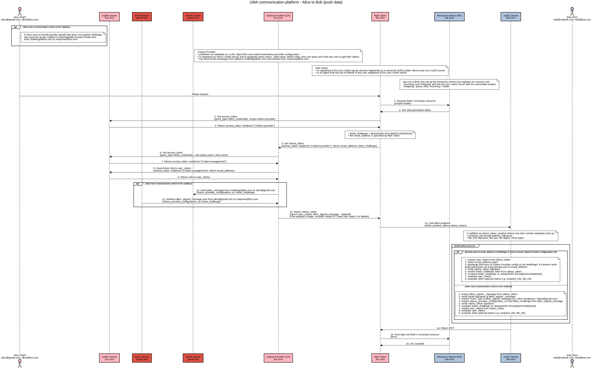
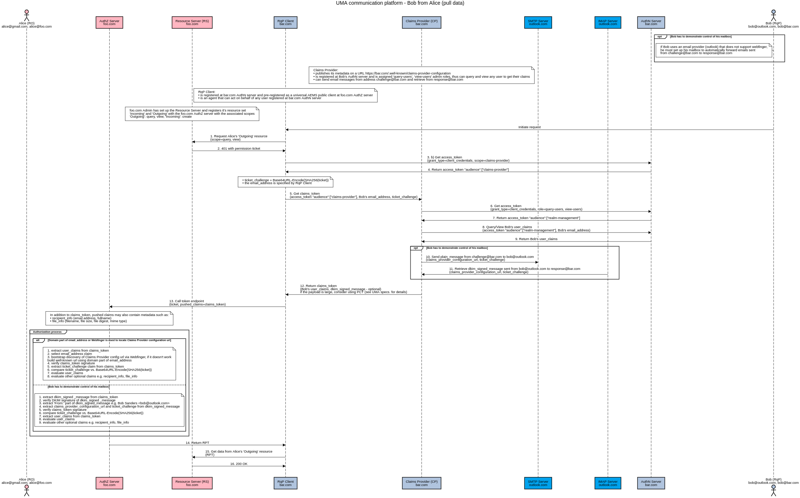

# Authorization-Enhanced Mail System (AEMS)

A prototype implementation of the [authorization-enhanced-mail-system][1] draft proposal, working as a proof of concept.

## Screenshot

## Schematic Flows

### Push email links

### Pull email data

# UMA communication platform

## Sequence diagrams

To transfer data from sender to recipient, AEMS uses a push/pull mechanism and the UMA wide ecosystem topology (AEMS ⊃ UMA wide ecosystem).

This concept works without shared OIDC provider and without federated OIDC providers. There is no need to have a trust relationship (a contract) between security domains foo.com and bar.com. This concept uses an UMA-compliant challenge–response mechanism with the permission ticket.

The RqP Client is pre-registered as a universal AEMS public client.

In addition to claims_token, pushed claims may also contain metadata such as: recipient_info (email address, fullname), file_info (filename, file size, file digest, mime type).

The diagrams are not vendor neutral; several Keycloak IAM features are used here (realm-management client, query-users and view-users roles) to get claims of any user.

Last but not least, this concept is usable even if your email provider does not support the webfinger protocol.

### Push data

### Pull data

## Demo and Documentation

WIP, early stage [umabox.org][2].

## Acknowledgment

Credits go to [WG - User Managed Access][3].

[1]: https://github.com/uma-email/proposal
[2]: https://www.umabox.org
[3]: https://kantarainitiative.org/confluence/display/uma/Home