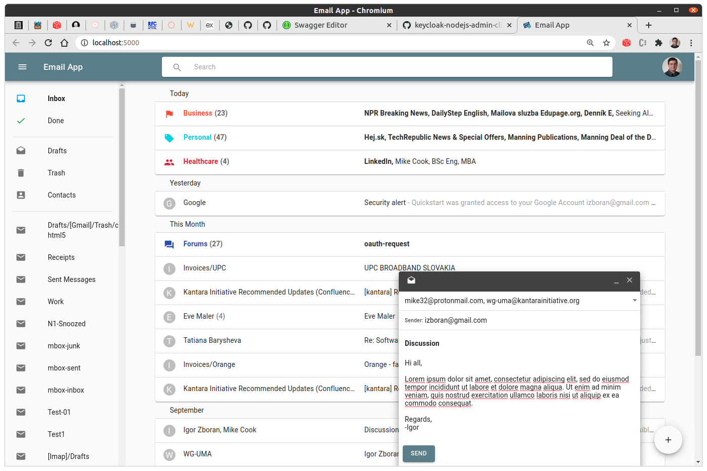
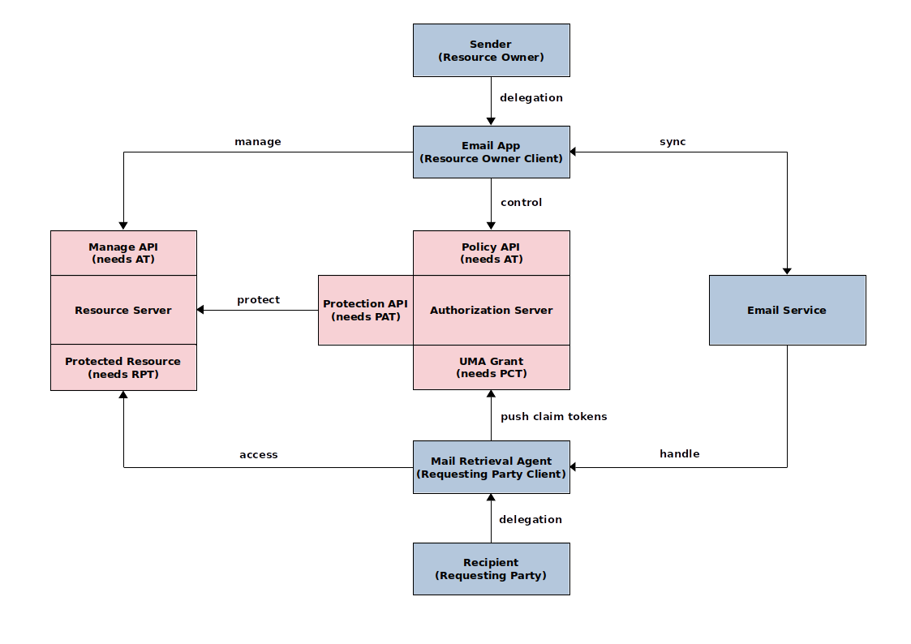

# uma-email-poc

A prototype implementation of the [authorization-enhanced-mail-system][1] draft proposal, working as a proof of concept.

## Screenshot



## Abstract Flow



## Description

The project comes with:

* email-service: A server with a JMAP interface that communicates with your email service provider.
* email-app: A webmail client that runs against the JMAP email-service interface.
* jmap-demo-webmail: A simple, but in many ways surprisingly sophisticated JMAP demo webmail client forked from the [jmapio/jmap-demo-webmail][2] repo.
* mail-retrieval-agent: An agent that fetches data from a local or remote resource server and stores it into a local resource server.
* resource-server: A RESTful records storage and retrieval server.
* keycloak-config: A Keycloak IAM configuration example.

## Running Server

To run server from the command line, use `node`.

## Deploying server using Docker

To build the Dockerized version of the server, run

```
docker build . -t aems:latest
```

Once the Docker image is correctly built, you can test it locally using

```
docker run -p 8080:8080 aems:latest
```
## Support

Support for code in this repository is limited.

[1]: https://github.com/uma-email/proposal
[2]: https://github.com/jmapio/jmap-demo-webmail
