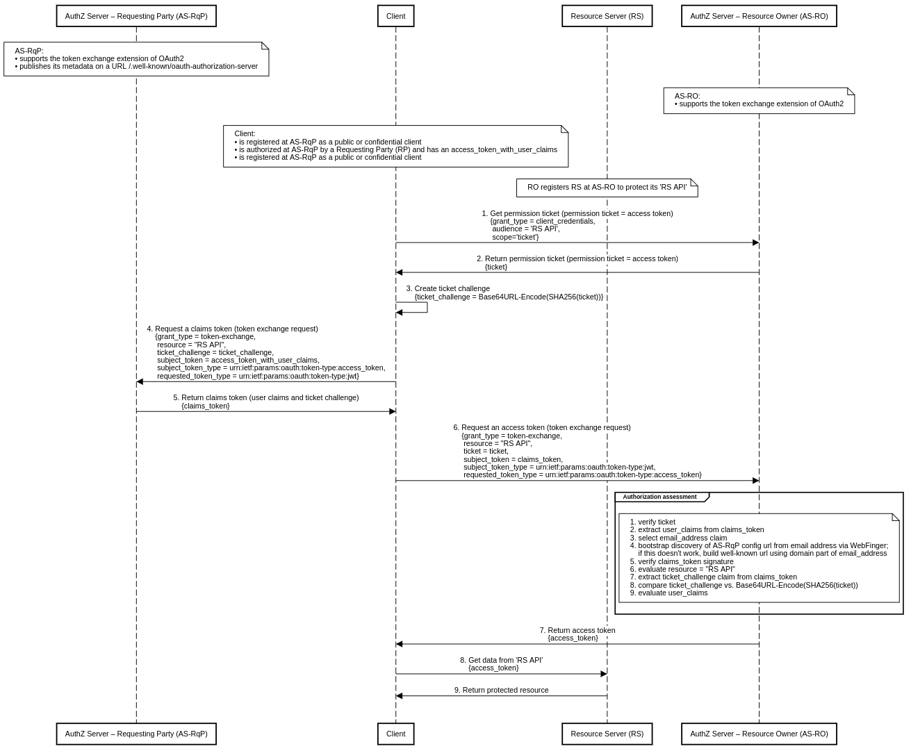

# Authorization-Enhanced Mail System

A prototype implementation of the [Authorization-Enhanced Mail System (AEMS)][1] draft proposal, working as a proof of concept.

## Screenshot

# Correlated Authorization

To transfer data from sender to recipient, AEMS uses [Correlated Authorization][2] technology, which has been designed with the "cross-domain access control" in mind.

Correlated Authorization is a Double Cross-Domain Authorization mechanism that works without shared central OIDC provider as well as without federated OIDC providers.

The requesting party and the resource owner may use mutually isolated instances of the authorization server residing on different (security) domains. This concept uses a permission ticket as a correlation handler between two authorization processes and an e-mail address as a unique requesting party identifier for identity-based access control.

## Sequence diagrams

### UMA-compliant

Prerequisites:

* Both authorization servers support the token exchange extension of OAuth2 ([RFC 8693][3]).
* The AS-RqP publishes its metadata on a URL /.well-known/oauth-authorization-server.
* The RqP Client is registered at the AS-RqP as a public or confidential client and is authorized at the AS-RqP by a RP and has an access token with user claims.
* The RqP Client is registered at the AS-RO as a public or confidential client.
* The RO has set up the RS and registers its 'RS API' resource at the AS-RO according to the [UMA Federated Authorization][4] specification.

Steps:

1. The RqP directs the RqP Client to access the 'RS API' resource with no access token.
2. Without an access token, the RS will return HTTP code 401 (Unauthorized) with a permission ticket.
3. The RqP Client creates a ticket challenge derived from the permission ticket using the following transformation ticket_challenge = Base64URL-Encode(SHA256(ticket)).
4. At the AS-RqP the RqP Client requests a claims token by presenting the access token with user claims and the created ticket challenge.
5. The AS-RqP returns the claims token.
6. At the AS-RO the RqP Client requests an RPT by presenting the claims token and the permission ticket.
7. After an authorization assessment, it is positive, the AS-RO returns RPT.
8. With the valid RPT the RqP Client tries to access the 'RS API'.
9. The RS validates the RPT, it is valid, the RS allow access the protected 'RS API' resource. 

### Generic

Prerequisites:

* Both authorization servers support the token exchange extension of OAuth2 ([RFC 8693][3]).
* The AS-RqP publishes its metadata on a URL /.well-known/oauth-authorization-server.
* The RqP Client is registered at the AS-RqP as a public or confidential client and is authorized at the AS-RqP by a RP and has an access token with user claims.
* The RqP Client is registered at the AS-RO as a public or confidential client..
* The RO registers the RS at the AS-RO to protect its RS API.

Steps:

1. The RqP Client requests the AS-RO to get a permission ticket to access the 'RS API' resource. The created permission ticket is an access token with a scope 'ticket'.
2. The AS-RO returns the permission ticket.
3. The RqP Client creates a ticket challenge derived from the permission ticket using the following transformation ticket_challenge = Base64URL-Encode(SHA256(ticket)).
4. At the AS-RqP the RqP Client requests a claims token by presenting the access token with user claims and the created ticket challenge.
5. The AS-RqP returns the claims token.
6. At the AS-RO the RqP Client requests an access token by presenting the claims token and the permission ticket.
7. After an authorization assessment, it is positive, the AS-RO returns the access token.
8. With the valid access token the RqP Client tries to access the 'RS API'.
9. The RS validates the access token, it is valid, the RS allow access the protected 'RS API' resource. 

## Demo and Documentation

WIP, early stage [umabox.org][6].

## Acknowledgment

Credits go to [WG - User Managed Access][5].

[1]: https://github.com/uma-email/proposal/blob/master/authorization-enhanced-mail-system-draft-02.pdf
[2]: https://github.com/uma-email/proposal/blob/master/correlated-authorization-draft-00.pdf
[3]: https://www.rfc-editor.org/rfc/rfc8693.html
[4]: https://docs.kantarainitiative.org/uma/wg/rec-oauth-uma-federated-authz-2.0.html
[5]: https://kantarainitiative.org/confluence/display/uma/Home
[6]: https://www.umabox.org
