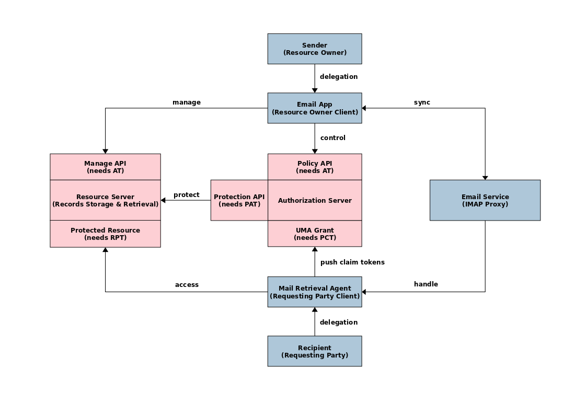

# Electronic (Health) Records Storage, Exchange and Retrieval System

A prototype implementation of the [authorization-enhanced-mail-system][1] draft proposal, working as a proof of concept.

## Screenshot

## Abstract Flow

## Development

Main development has been temporarily moved to [github.com/1token/email-service][2] repo.

[1]: https://github.com/uma-email/proposal
[2]: https://github.com/1token/email-service
