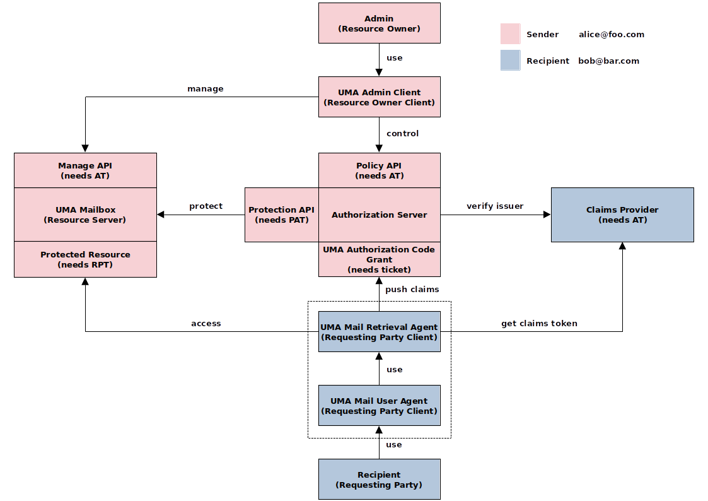

# Authorization-Enhanced Mail System

A prototype implementation of the [authorization-enhanced-mail-system][1] draft proposal, working as a proof of concept.

## Screenshot

## Schematic Flow

### Push mail envelope

### Pull mail resources

## Demo and Documentation

WIP, early stage [umabox.org][2].

[1]: https://github.com/uma-email/proposal
[2]: https://www.umabox.org
