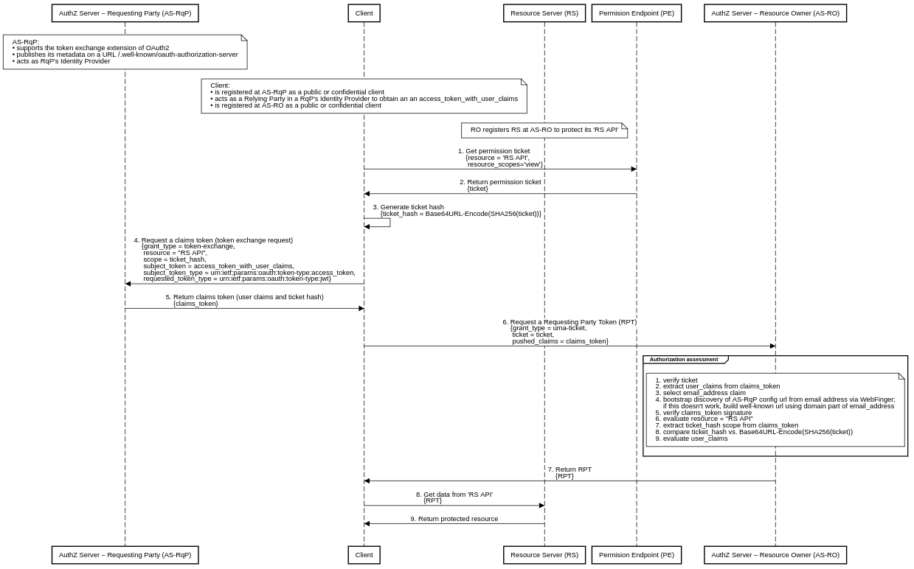

### UMA Experimental

This diagram represents a [Correlated Authorization (CAZ)][1] protocol based on the experimental UMA protocol, which does not require a protection API access token. The permission ticket is obtained directly by the client from the permission endpoint.

Prerequisites:

* The AS-RqP supports the [OAuth 2.0 Token Exchange][2] extension of OAuth2.
* The AS-RqP also acts as RqP's Identity Provider.
* The AS-RqP publishes its metadata on a URL /.well-known/oauth-authorization-server (alternatively on /.well-known/openid-configuration).
* The client is registered at the AS-RqP as a public or confidential client and acts as a Relying Party in a RqP's Identity Provider to obtain an access token with user claims.
* The client is registered at the AS-RO as a public or confidential client.
* The RO registers the RS at the AS-RO to protect its RS API.

Steps:

1. The RqP directs the client to the AS-RO permission endpoint to get the permission ticket.
2. The AS-RO returns the permission ticket.
3. The client generates a ticket hash derived from the permission ticket using the following transformation ticket_hash = Base64URL-Encode(SHA256(ticket)).
4. At the AS-RqP the client requests a claims token by presenting the access token with user claims and the generated ticket hash.
5. The AS-RqP returns the claims (JWT) token.
6. At the AS-RO the client requests an access token via a JWT grant type by presenting the claims (JWT) token and the permission ticket.
7. After an authorization assessment, it is positive, the AS-RO returns the access token.
8. With the valid access token the client tries to access the 'RS API'.
9. The RS validates the access token, it is valid, the RS allow access the protected 'RS API' resource.

### Use Cases

Rapid CAZ/UMA RPT-based protocol prototyping and testbeds.

[1]: https://github.com/uma-email/poc
[2]: https://www.rfc-editor.org/rfc/rfc8693.html
